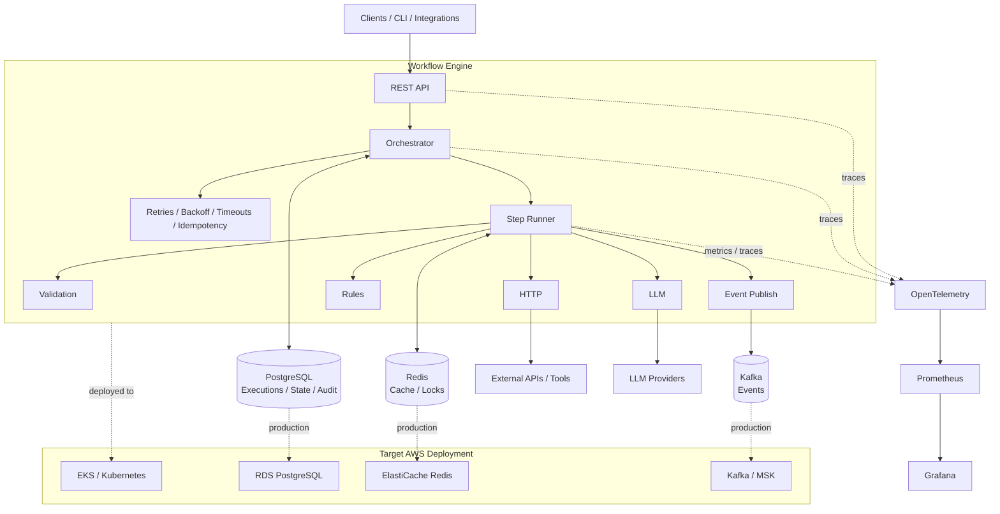

# PandectRun Architecture

This diagram describes the target architecture. Components are introduced incrementally according to the project roadmap; the first runnable version does not require every component shown here.

## Execution Path

1. A client submits an execution request through the API.
2. The orchestrator loads and validates the workflow definition and creates durable execution state.
3. The step runner executes eligible steps according to their dependencies.
4. Step implementations call deterministic logic, external APIs, LLM providers, or the event layer.
5. Intermediate results and execution transitions are persisted.
6. Recoverable failures are handled according to step retry, timeout, and idempotency policies.
7. Logs, metrics, traces, and audit events provide visibility into the execution.

## Architectural Boundaries

- **PostgreSQL** is the system of record for workflow definitions, executions, intermediate state, and audit history.
- **Redis** is an optimization and coordination layer, not the source of truth.
- **Kafka** supports asynchronous event-driven and distributed execution as the project evolves; it is not required for the initial sequential engine.
- **LLM providers** are behind a provider abstraction so workflow definitions are not coupled to a specific model vendor.
- **Observability** is part of the execution model rather than an afterthought: workflow, step, and external-call telemetry should share trace context.
- **Kubernetes/AWS** represent the target production deployment. Local development remains runnable with a lightweight Docker-based stack.
