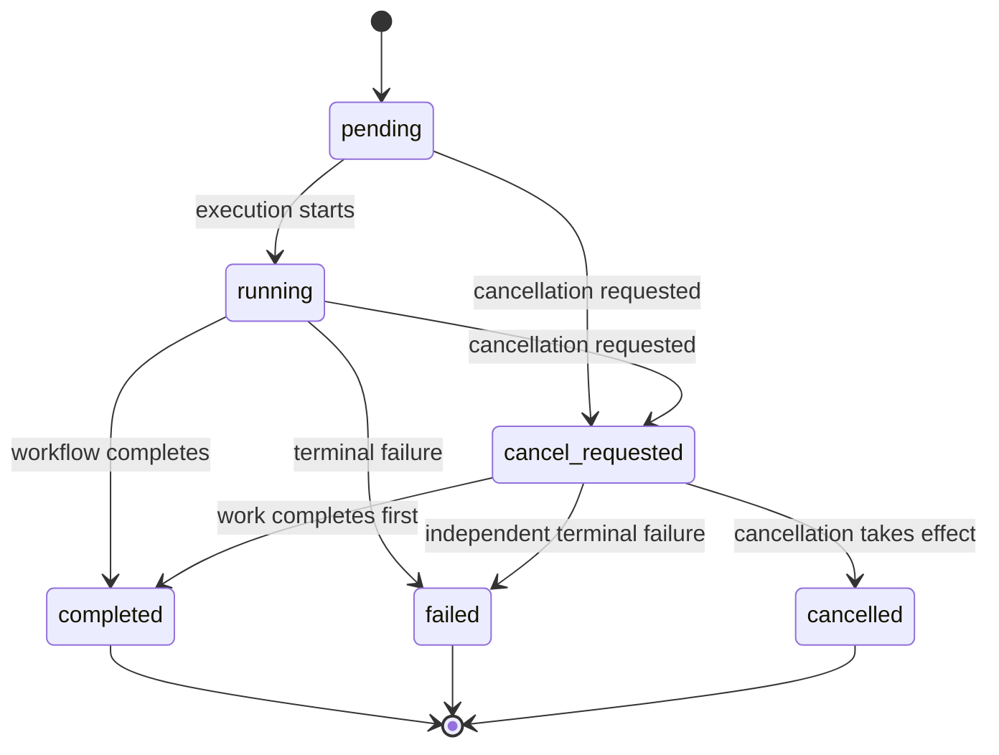
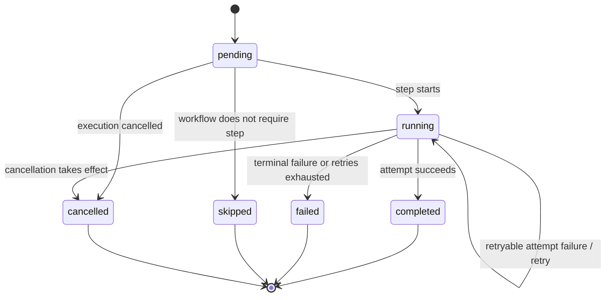
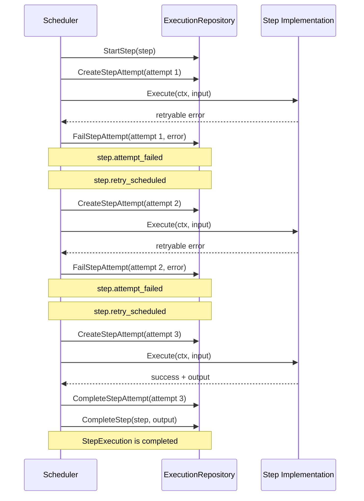
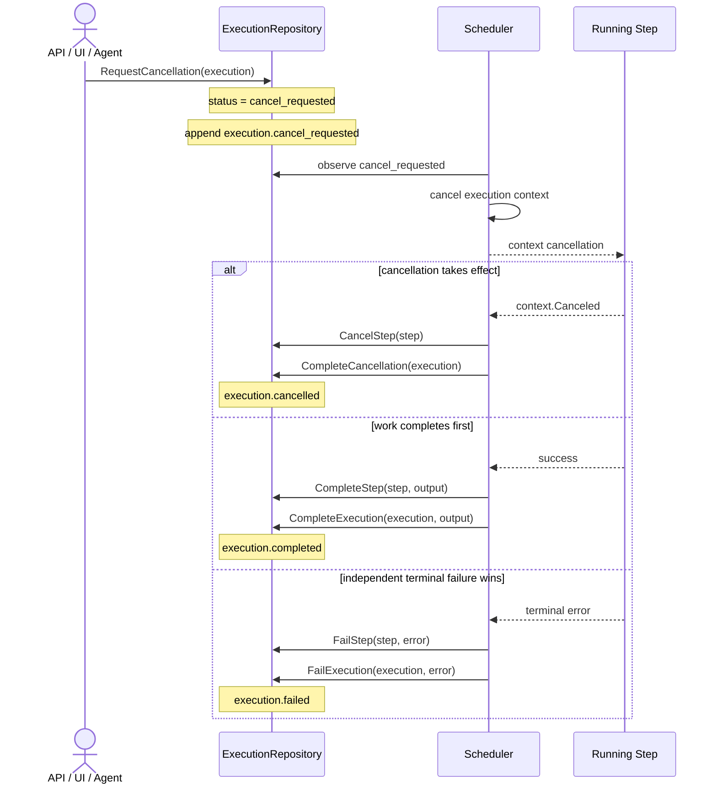
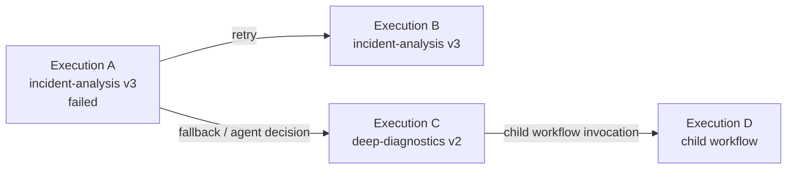
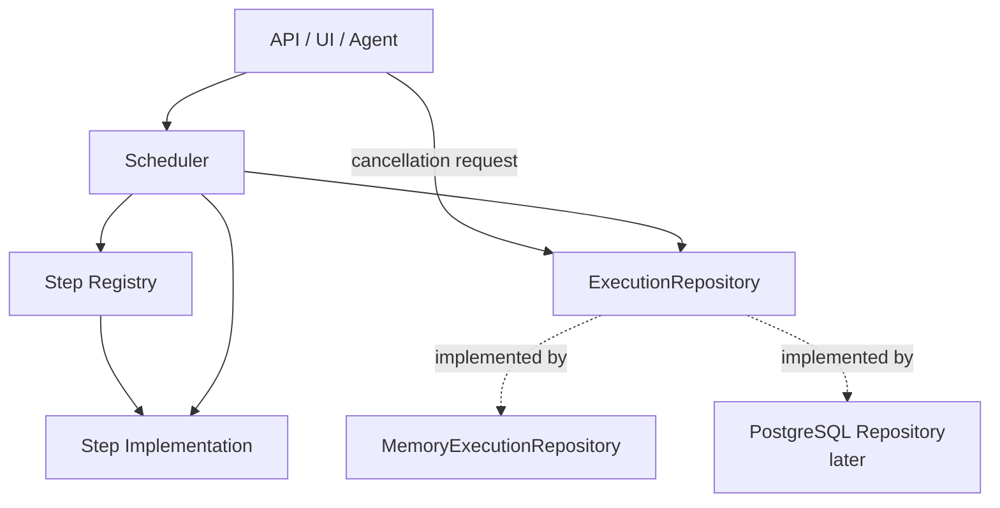
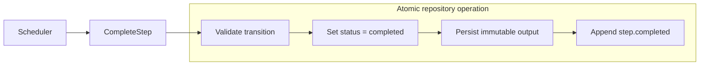

# Execution Lifecycle Diagrams

This document provides Mermaid diagrams for the execution-persistence design in [`execution-persistence.md`](execution-persistence.md). The diagrams are intended to make lifecycle transitions, retries, cancellation races, and execution relationships easier to review independently of the repository API details.

## Execution lifecycle

Cancellation is best-effort. `cancel_requested` records intent, while the terminal state records the actual outcome.

The three transitions out of `cancel_requested` are deliberate. A cancellation request does not guarantee that cancellation wins a race with successful completion or an independent terminal failure.

## Step lifecycle

A logical step may have multiple attempts. Attempt failures are not terminal step failures while retry remains possible.

`skipped` and `cancelled` are intentionally distinct. A skipped step is omitted because of workflow semantics; a cancelled step would otherwise have run or completed but execution was terminated.

## Retry sequence

Retries belong to a `StepExecution`. They do not create new workflow executions.

The repository operations shown here are conceptual. The implementation may combine operations where doing so is necessary to preserve atomic state and event semantics.

## Cancellation sequence

A cancellation request is persisted before the scheduler attempts to stop active work.

The scheduler must distinguish cancellation-caused `context.Canceled` from an independent failure so cancellation does not incorrectly trigger retry/failure behavior.

## Execution relationships

Retrying an entire workflow or selecting a different workflow creates a new execution. Existing execution history is not reset or rewritten.

The relationship between executions and the trigger that initiated an execution are separate concepts. For example, Execution C may be related to Execution A as a fallback while its trigger identifies an agent as the initiator.

## Persistence boundary

The scheduler depends on repository semantics, not a particular storage technology.

The in-memory repository is the first implementation. It should enforce the same lifecycle, immutability, event-ordering, and atomic-operation semantics expected from a later PostgreSQL implementation.

## Atomic state and event transition

State and its corresponding audit event are one logical repository operation.

For the in-memory repository, the atomic boundary can be protected by one mutex. A PostgreSQL implementation can later provide the same semantic boundary with a transaction.
