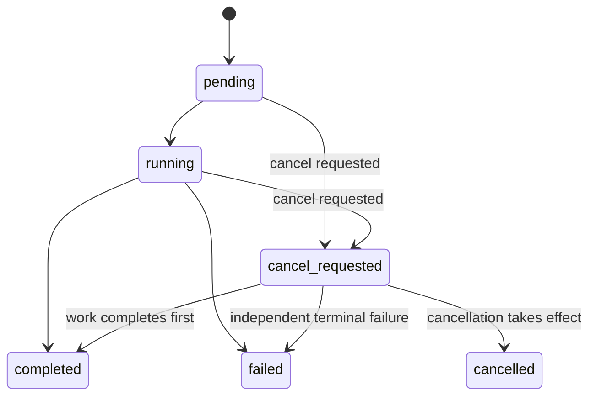

# Execution Persistence Design

This document defines the persistence contract for PandectRun workflow executions before a database-specific implementation is introduced. The first implementation is expected to be an in-memory repository used by the scheduler and tests; PostgreSQL can later implement the same semantics.

The design intentionally focuses on execution state, attempts, events, cancellation, and execution provenance. It does not define distributed worker coordination, PostgreSQL schema details, or the REST transport.

## Design goals

- Keep the scheduler independent of the persistence implementation.
- Preserve immutable execution history and completed step output.
- Model retries as attempts of a logical step execution.
- Make important state transitions and their audit events atomic.
- Treat cancellation as a first-class, best-effort operation.
- Preserve why an execution was started and its relationship to other executions.
- Make the in-memory repository concurrency-safe so repository semantics do not depend on the current sequential scheduler.

## Runtime entities

### Execution

An `Execution` is one invocation of a particular workflow definition version. Workflow identity, version, input, creation time, and provenance are immutable after creation. Runtime status and terminal output are mutable only through defined lifecycle operations.

### StepExecution

A `StepExecution` is the logical execution of one workflow step within an execution. A step may have multiple attempts, but it has one final status and at most one immutable completed output.

### StepAttempt

A `StepAttempt` records one attempt to execute a logical step. Failed retryable attempts do not make the `StepExecution` failed. `StepFailed` is reserved for terminal failure after an error is classified as terminal or retries are exhausted.

### ExecutionEvent

An `ExecutionEvent` is an append-only record of a meaningful lifecycle occurrence. Events provide audit history and eventually back the execution-events API. Current state is not reconstructed solely from events; entity state and events are persisted together where consistency requires it.

### ExecutionRelation

Executions may be related without being part of the same workflow execution. A retry of an entire execution, an agent-selected fallback workflow, or a workflow that invokes another workflow should create a new execution rather than mutate the history of the original execution.

Relations are first-class rather than opaque metadata because PandectRun, its API, and its UI may need to understand and query them. The exact initial relation vocabulary should remain small and can be finalized when relations are first implemented.

Execution provenance is separate from execution relationships. A trigger identifies what initiated an execution (for example an API request, user, agent, workflow, schedule, or system action); a relation identifies how that execution is connected to another execution.

## Execution lifecycle

The execution statuses are:

- `pending`
- `running`
- `cancel_requested`
- `completed`
- `failed`
- `cancelled`

`completed`, `failed`, and `cancelled` are terminal.



Cancellation is best-effort. `cancel_requested` records intent; it does not guarantee `cancelled` as the final outcome.

If work completes successfully before cancellation takes effect, the execution is `completed`. If work terminates because cancellation takes effect, it is `cancelled`. If an independent terminal failure wins the race, it is `failed`.

This distinction is important for auditability and metrics: a cancellation request must not automatically rewrite a successful completion or genuine failure as cancellation.

## Step lifecycle and attempts

Step statuses include:

- `pending`
- `running`
- `completed`
- `failed`
- `skipped`
- `cancelled`

`skipped` and `cancelled` have different meanings. A skipped step was deliberately not required by workflow semantics; a cancelled step did not run or finish because execution was terminated.

Retries occur within one `StepExecution`:

```text
StepExecution
    Attempt 1 -> failed, retryable
    Attempt 2 -> failed, retryable
    Attempt 3 -> completed
StepExecution -> completed
```

Retrying an entire failed execution is different. It creates another `Execution` related to the failed execution rather than resetting or rewriting the failed execution.

A completed step's output is immutable.

## Events

The initial event vocabulary should distinguish logical step state from individual attempts:

- `execution.created`
- `execution.started`
- `execution.cancel_requested`
- `execution.completed`
- `execution.failed`
- `execution.cancelled`
- `step.started`
- `step.attempt_started`
- `step.attempt_failed`
- `step.retry_scheduled`
- `step.completed`
- `step.failed`
- `step.cancelled`

Not every possible future event needs to be implemented immediately. The important distinction is that an attempt failure is not a terminal step failure, and a cancellation request is not the same event as cancellation taking effect.

Events are append-only and ordered within an execution.

## Repository boundary

The scheduler depends on an execution repository interface rather than directly owning persistence or depending on an in-memory map or PostgreSQL.

The repository should expose domain operations rather than unrestricted entity updates. Generic methods such as `UpdateExecution` or `UpdateStepExecution` make it too easy to overwrite immutable data, perform illegal state transitions, or separate state changes from required audit events.

A representative interface is:

```go
type ExecutionRepository interface {
    CreateExecution(context.Context, Execution) error
    GetExecution(context.Context, ExecutionID) (Execution, error)

    StartExecution(context.Context, ExecutionID) error
    CompleteExecution(context.Context, ExecutionID, json.RawMessage) error
    FailExecution(context.Context, ExecutionID, ExecutionError) error

    RequestCancellation(context.Context, ExecutionID) error
    CompleteCancellation(context.Context, ExecutionID) error

    CreateStepExecution(context.Context, StepExecution) error
    GetStepExecution(context.Context, StepExecutionID) (StepExecution, error)
    ListStepExecutions(context.Context, ExecutionID) ([]StepExecution, error)

    StartStep(context.Context, StepExecutionID) error
    CompleteStep(context.Context, StepExecutionID, json.RawMessage) error
    FailStep(context.Context, StepExecutionID, ExecutionError) error
    CancelStep(context.Context, StepExecutionID) error

    CreateStepAttempt(context.Context, StepAttempt) error
    CompleteStepAttempt(context.Context, StepAttemptID) error
    FailStepAttempt(context.Context, StepAttemptID, ExecutionError) error
    ListStepAttempts(context.Context, StepExecutionID) ([]StepAttempt, error)

    ListEvents(context.Context, ExecutionID) ([]ExecutionEvent, error)
}
```

This is a design shape rather than a frozen Go API. In particular, IDs, error return values, and whether some operations are combined may evolve while implementing the in-memory repository.

Execution relations may be added to this repository when they become executable behavior. The data model should leave room for them now without requiring the first scheduler integration to use them.

## Atomic lifecycle operations

State transitions and their corresponding events must not be independently persisted when they describe one logical operation.

For example, `CompleteStep` should atomically:

1. verify that completion is a legal transition;
2. set the step status to `completed`;
3. persist the immutable step output and completion time;
4. append `step.completed`.

Similarly, `RequestCancellation` should atomically transition the execution to `cancel_requested` and append `execution.cancel_requested`.

The in-memory repository can provide this atomicity under one mutex. A PostgreSQL implementation can later provide the same contract with a transaction.

This prevents states such as a completed step with no corresponding completion event after a process failure between separate writes.

## Cancellation semantics

Cancellation is part of the repository and scheduler contract from the beginning.

A cancellation request should be idempotent for an execution that is already `cancel_requested` or `cancelled`. A completed or failed execution cannot subsequently be cancelled.

The scheduler should execute steps using an execution-derived `context.Context`. When cancellation is observed, it cancels that context so cooperative step implementations, HTTP requests, database operations, retry waits, and model calls can stop promptly.

The `Step` contract should document that implementations are expected to honor context cancellation when possible.

Cancellation can race with completion or failure. The scheduler must classify the actual cause of termination rather than treating every error after a cancellation request as cancellation. In particular, `context.Canceled` caused by the execution cancellation path should not be reported as a workflow failure or passed into normal retry handling.

Pending steps that will no longer execute because cancellation took effect should become `cancelled`, not `skipped`.

## In-memory repository

The first implementation should be concurrency-safe even though the initial scheduler is sequential.

A likely shape is:

```go
type MemoryExecutionRepository struct {
    mu sync.RWMutex

    executions map[ExecutionID]Execution
    steps      map[StepExecutionID]StepExecution
    attempts   map[StepAttemptID]StepAttempt
    events     map[ExecutionID][]ExecutionEvent
    relations  []ExecutionRelation
}
```

The implementation should satisfy the repository interface explicitly:

```go
var _ ExecutionRepository = (*MemoryExecutionRepository)(nil)
```

Tests should exercise repository semantics, not merely map storage. Important cases include legal and illegal state transitions, immutable completed output, retry attempt history, event ordering, cancellation idempotency, and races represented by transitions from `cancel_requested` to each permitted terminal state.

## Scheduler integration

Once the in-memory repository exists, scheduler tests should execute a workflow through the repository and assert the durable representation of what happened:

- execution status;
- step statuses and outputs;
- attempt history;
- event history and ordering.

The scheduler should no longer be the sole owner of runtime state.

## Deferred concerns

This design deliberately does not yet solve:

- PostgreSQL table and index design;
- distributed ownership or leases;
- cross-process cancellation notification;
- Kafka or other event publication;
- parallel step execution;
- conditional branches and dynamic DAGs;
- relation-specific behavior for retries, fallbacks, or child workflows;
- authentication/authorization identity for provenance;
- event retention or archival.

These concerns should be added when their requirements are concrete, while preserving the lifecycle and repository semantics defined here.
